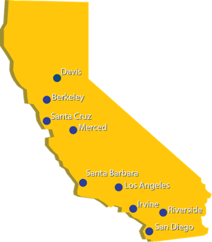
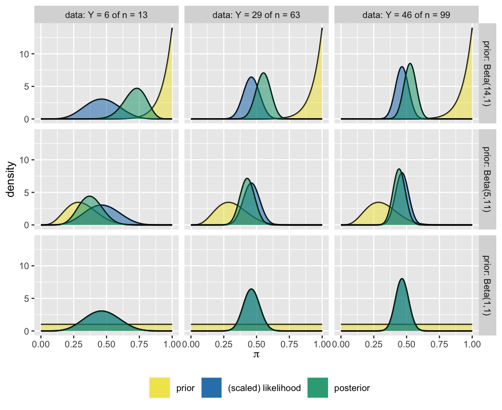

class: middle center

```{r setup, include=FALSE}
knitr::opts_chunk$set(echo = TRUE,
                      comment="")
```

```{r echo=FALSE, message=FALSE}
library(tidyverse)
library(bayesrules)
library(rstanarm)
library(bayesplot)
theme_set(theme_gray(base_size = 18))
```

```{r xaringan-panelset, echo=FALSE}
xaringanExtra::use_panelset()
```


        

.large[`r fontawesome::fa(name = "twitter")`] <a href = "http://twitter.com/MineDogucu">MineDogucu</a>  
.large[`r fontawesome::fa(name = "github")`] <a href = "http://github.com/mdogucu">mdogucu</a>  
.large[`r fontawesome::fa(name = "link")`] <a href = "http://minedogucu.com">minedogucu.com</a>


---

class: middle

```{r echo=FALSE, fig.align='center', out.width="40%", fig.alt="California Map with different locations of University of California campuses pinned."}

```

---

class: middle 

## İstatistik ve Veri Bilimi Eğitimcilerinin/Akademisyenlerinin Teknolojik Araç Kullanımı Örneği

- Araştırma: R

- Öğrenme: Grafik hesap makinesi 

- Öğretme: Sunum programı

<br>

[Dogucu & Çetinkaya-Rundel, 2022](https://arxiv.org/abs/2202.09504)

---

class: middle 

## Benim Teknolojik Araç Kullanımım

- Araştırma: R

- Öğrenme: ~~Grafik hesap makinesi~~ R 

- Öğretme: ~~Sunum programı~~ R

---

class: middle 

## R eğitimi

- Öğrenme: R
    - Öğrenciye R kullanmayı öğretme (örn: Veri Bilimine giriş)
    - Öğrenciye istatistik öğretirken R'dan faydalanması (örn: İstatistik ve Olasılığa giriş)
  
- Öğretme: R

---

class: center middle

<span style="font-size:75px;">
Öğrenme için R
</span>
---

class: center middle 


        
Veri Bilimine Giriş

[`r fontawesome::fa(name = "github")`](https://github.com/ics80-fa21)[`r fontawesome::fa(name = "link")`](https://www.introdata.science)


---
class: center middle 


        
Bayesyen Veri Analizine Giriş

[`r fontawesome::fa(name = "github")`](https://github.com/mdogucu/stats115-wi21-website)[`r fontawesome::fa(name = "link")`](https://www.stats115.com/)


---


class:center

```{r echo=FALSE, fig.align='center', out.width="25%", fig.alt="a hex shaped logo with shiny green-pink disco ball and purple starry background. There is text that says Bayes Rules!"}
knitr::include_graphics("img/bayes-rules-hex.png")
```


.pull-left[
<script src="https://use.fontawesome.com/releases/v5.15.1/js/all.js" data-auto-replace-svg="nest"></script>

<i class="fas fa-book fa-2x" aria-hidden="true" title="Book icon"></i>

[Bayes Rules! An Introduction to Applied Bayesian Modeling](https://bayesrulesbook.com)

]

.pull-right[

<i class="fab fa-r-project fa-2x" aria-hidden="true" title="R logo"></i>

[{bayesrules}](https://www.github.com/bayes-rules/bayesrules)
]

---


class: middle 

.pull-left[
.center[

 


Alicia Johnson          
.font-20[Macalester College]
        
[`r fontawesome::fa(name = "link")`](https://ajohns24.github.io/portfolio)
[`r fontawesome::fa(name = "github")`](https://github.com/ajohns24)

]
]

.pull-right[
.center[


Miles Ott  
.font-20[Twitter]

[`r fontawesome::fa(name = "link")`](https://milesott.com/)
[`r fontawesome::fa(name = "github")`](https://github.com/MilesOtt)
[`r fontawesome::fa(name = "twitter")`](https://twitter.com/Miles_Ott)

]
]


---

## Binom Olabilirlik

```{r fig.align='center', fig.height=4, fig.alt="X axis reads pi with values from 0 to 1. Y axis reads l of pi given capital Y = y). The curve of the graph has a high peak on the y-axis when pi equals to 0.3. The y-values are almost zero when pi is greater than 0.75."}
plot_binomial_likelihood(y = 3, n = 10)
```

---

## Önsel Model (Beta Modeli)

.pull-left[

```{r fig.align='center', fig.height=4, fig.alt="X axis reads pi with values from 0 to 1. Y axis reads f of pi). The curve of the graph has a high peak on the y-axis when pi equals to 0.5. The distribution is symmentric."}
plot_beta(alpha = 4, beta = 4)
```

]

.pull-right[

```{r fig.align='center', fig.height=4, fig.alt="X axis reads pi with values from 0 to 1. Y axis reads f of pi). The curve of the graph has a high peak on the y-axis when pi equals to 0. The curve is a concave one and y is decreasing as pi is increasing."}
plot_beta(alpha = 1, beta = 10)
```

]

---

## Sonsal Model

```{r fig.align='center', fig.height=4, fig.alt="X axis reads pi with values from 0 to 1. Y axis reads density. Three curves are shown labeled as prior, (scaled) likelihood, and posterior. The prior curve of the graph has a high peak on the y-axis when pi equals to 0. The curve is a concave one and y is decreasing as pi is increasing. The likelihood curve has a high peak on the y-axis when pi equals to 0.3. The y-values are almost zero when pi is greater than 0.75. The posterior sits between the prior and likelihood curves."}
plot_beta_binomial(alpha = 1, beta = 10, y = 3, n = 10)
```

prior - önsel model | (scaled) likelihood - ölçekli olabilirlik | posterior - sonsal model

---


class: middle

```{r echo=FALSE, out.width="60%", fig.align='center'}

```


---


class: middle

```{r}
one_mh_iteration <- function(w, current){
 # STEP 1: Propose the next chain location
 proposal <- runif(1, min = current - w, max = current + w)
  
 # STEP 2: Decide whether or not to go there
 proposal_plaus <- dnorm(proposal, 0, 1) * dnorm(6.25, proposal, 0.75)
 current_plaus  <- dnorm(current, 0, 1) * dnorm(6.25, current, 0.75)
 alpha <- min(1, proposal_plaus / current_plaus)
 next_stop <- sample(c(proposal, current), 
  size = 1, prob = c(alpha, 1-alpha))
  
 # Return the results
 return(data.frame(proposal, alpha, next_stop))
}
```

---


```{r cache=TRUE}
mh_tour <- function(N, w){
  # 1. Start the chain at location 3
  current <- 3

  # 2. Initialize the simulation
  mu <- rep(0, N)

  # 3. Simulate N Markov chain stops
  for(i in 1:N){    
    # Simulate one iteration
    sim <- one_mh_iteration(w = w, current = current)
    
    # Record next location
    mu[i] <- sim$next_stop
    
    # Reset the current location
    current <- sim$next_stop
  }
  
  # 4. Return the chain locations
  return(data.frame(iteration = c(1:N), mu))
}
```

---

```{r cache=TRUE}
set.seed(84735)
mh_simulation_1 <- mh_tour(N = 5000, w = 1)
```

.pull-left[
```{r echo=FALSE, , fig.height=5}
ggplot(mh_simulation_1, aes(x = mu)) + 
  geom_histogram(aes(y = ..density..), color = "white", bins = 20) + 
  stat_function(fun = dnorm, args = list(4,0.6), color = "red")
```
]

.pull-right[
```{r echo=FALSE, fig.height=5}
ggplot(mh_simulation_1, aes(x = iteration, y = mu)) + 
  geom_line()
```
]

---


class: middle

## `library(rstan)`


.pull-left[
```{r}
# STEP 1: DEFINE the model
stan_bike_model <- "
  data {
    int<lower=0> n;
    vector[n] Y;
    vector[n] X;
  }
  parameters {
    real beta0;
    real beta1;
    real<lower=0> sigma;
  }
  model {
    Y ~ normal(beta0 + beta1 * X, sigma);
  }
"
```

]


.pull-right[

```{r eval=FALSE}
# STEP 2: SIMULATE the posterior
stan_bike_sim <- 
  stan(model_code = stan_bike_model, 
  data = list(n = nrow(bikes), 
              Y = bikes$rides, X = bikes$temp_feel), 
  chains = 4, iter = 5000*2, seed = 84735)
```

]

---

class: middle

## `library(rstanarm)`


```{r eval=FALSE}
normal_model_sim <- stan_glm(rides ~ temp_feel, 
                             data = bikes, 
                             family = gaussian, 
                             chains = 4, iter = 5000*2,
                             seed = 84735)
```

```{r cache=TRUE, echo=FALSE}
normal_model_sim <- 
  stan_glm(rides ~ temp_feel, 
           data = bikes, 
           family = gaussian, 
           chains = 4, iter = 5000*2,
           seed = 84735,
           refresh = FALSE)
```

---


class: center middle

.large[Pedagojik Yaklaşım]


---


class: middle center 

Aktif Öğrenme

[Metropolis-Hastings Algorithm](https://www.bayesrulesbook.com/chapter-7.html#the-metropolis-hastings-algorithm)

```{r echo=FALSE, fig.align='center', out.width="20%", fig.alt="An icon of a student sitting on a chair and in front a desk with a computer typing."}

```

---


class: center middle

### İstatistik ve Programlama Bir Arada

.pull-left[
<i class="fas fa-laptop-code fa-6x" aria-hidden="true" title="Laptop icon with code"></i>
]

<i class="fas fa-subscript fa-6x" aria-hidden="true" title="X sub 1"></i>


---

class: middle center

.pull-left[

### Bir Kere Hesap Yap

```{r echo=FALSE, fig.align='center', out.width="50%", fig.alt="A construction sign with a figure shoveling."}
knitr::include_graphics("img/build.png")
```
]

.pull-right[

### Sonra Fonskiyonları Kullan

<i class="fab fa-r-project fa-7x" aria-hidden="true" title="R logo"></i>


]

---

class: middle

## Erişebilirlik

- Görsel ve fiziksel erişim
- Eğitim materyallerinin ögrencilerin ilgisini çekmesi
- Geniş akademisyen kitlesinin çalışmalarından faydalanmak

<br>

[Dogucu, Johnson & Ott, 2021](https://arxiv.org/abs/2110.06355)


---

class: center middle

<span style="font-size:75px;">
Öğretme için R
</span>


---

class: middle

# Örnekler

.pull-left[
- Sunumlar

- Çalışma kağıtları

- Dersin websitesi


[Dogucu & Çetinkaya-Rundel, 2022](https://arxiv.org/abs/2202.09504)
]


.pull-right[

```{r echo=FALSE, fig.alt="NSF logo", out.width = "80%", fig.align="center"}

```
]
---

class: middle


.pull-left[

```{r echo=FALSE, fig.alt="NSF logo", out.width = "80%", fig.align="center"}
knitr::include_graphics("img/gradetools-logo.png")
```


]

.pull-right[

- Geri bildirim ve notlandırma sürecini otomatikleştirme
- Rubrik yönetimini kolaylaştırma

[Ricci, Medina & Dogucu, 2022](https://federicazoe.github.io/gradetools)
]
---

class: middle center

# Fon desteği


```{r echo=FALSE, fig.alt="NSF logo", out.width = "10%", fig.align="center"}
knitr::include_graphics("img/nsf-logo.png")
```

NSF HDR DSC award \#2123366 

---


.center[

.middle[

# Teşekkürler

.large[
[bit.ly/dogucu-talks](https://bit.ly/dogucu-talks)
]

.large[`r fontawesome::fa(name = "twitter")`] <a href = "http://twitter.com/MineDogucu">MineDogucu</a>  

]
]

.footnote[<a href="https://www.freepnglogos.com">Images from freepnglogos.com</a>]
